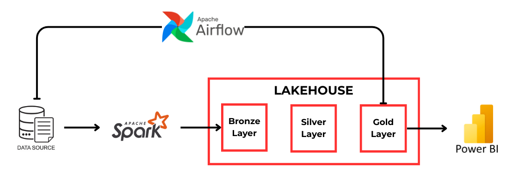
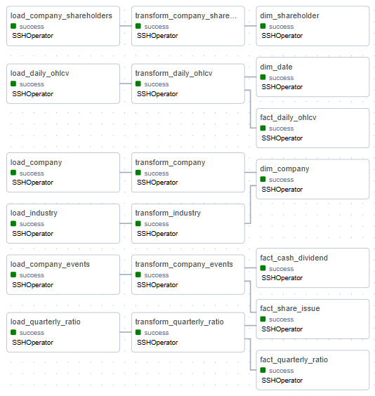
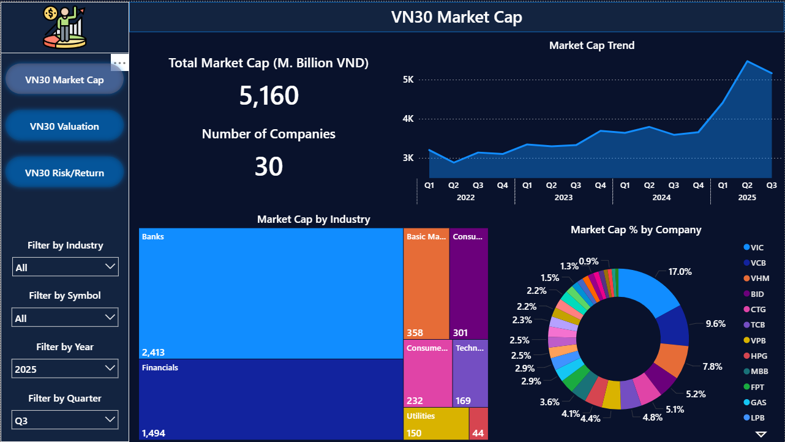
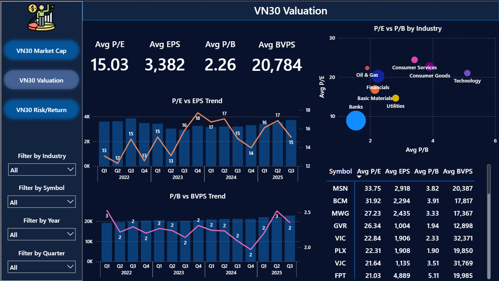
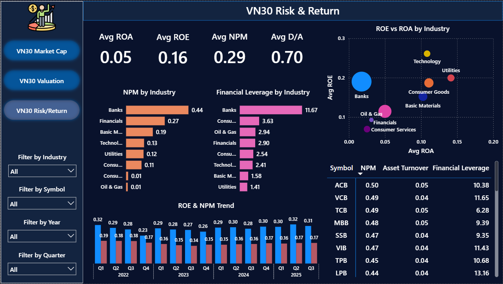
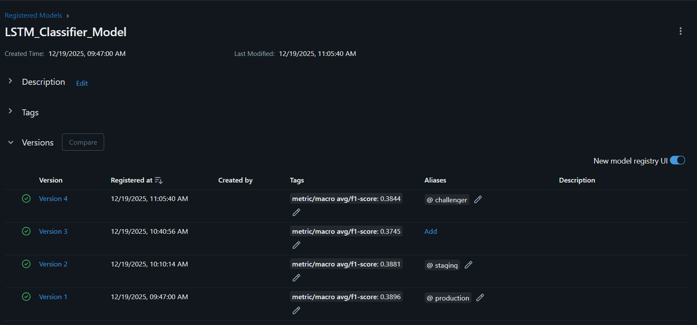
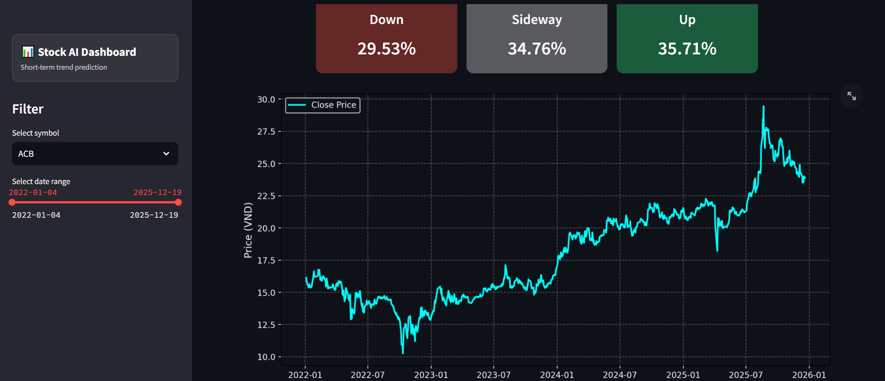

# 📑 Table of Contents

- [📌 1. Introduction](#-1-introduction)
- [🏗 2. Architecture](#-2-architecture)
- [📂 3. Project Structure](#-3-project-structure)
- [🚀 4. Setup](#-4-setup)

---

# 📌 1. Introduction

This project demonstrates a **Lakehouse architecture** built on **Iceberg tables**. Data is progressively refined through a **medallion architecture (Bronze → Silver → Gold)** for BI and ML use cases.

**Data Source:** Data fetched from `VNStock - Python Library`

### Key features of this project include:

- **_Data Engineering (DE):_**
  - Implement a unified Lakehouse that merges the flexibility of data lakes with the reliability of data warehouses using Iceberg tables.
  - Develop batch ELT pipelines with Apache Spark, orchestrated via Apache Airflow.
  - Refine raw data progressively across Bronze, Silver, and Gold layers for analytics and ML use cases.

- **_Data Analytics (DA):_**
  - Perform SQL-based querying on the Lakehouse through Trino.
  - Create Power BI dashboards to visualize key metrics and support decision-making.

- **_MLOps:_**
  - Track, manage, and register ML models using MLflow.
  - Deploy production-ready models via FastAPI and showcase results through an interactive Streamlit app.

---

# 🏗 2. Architecture

## 2.1 Lakehouse


## 2.2 Pipeline



---

# 📂 3. Project Structure

```text
batch-pipeline-via-lakehouse/
│
├── docker/                            # Docker setup
│   ├── airflow/                         # Airflow Dockerfile
│   ├── hive/                            # Hive metastore configuration + Dockerfile
│   ├── init/                            # Initialization scripts in containers
│   ├── ml-app/                          # Dockerfile to run MLFlow Server, FastAPI, Streamlit UI
│   ├── spark/                           # Spark configuration + Dockerfile
│   ├── trino/                           # Trino configuration
│
├── data/                              # Raw datasets
├── notebooks/                         # Notebooks for testing pipeline, data exploration, and training model
├── src/                               # Main scripts
│   ├── dags/                            # Airflow DAG scripts
│   ├── elt/                             # ELT scripts
│       ├── bronze/                        # Bronze layer scripts – load raw data
│       ├── silver/                        # Silver layer scripts – clean/enrich data
│       ├── gold/                          # Gold layer scripts – aggregated / analytics-ready
│   ├── model/                           # Scripts for preprocessing, training, evaluation, promoting model to MLFlow
│   ├── serving/                         # Scripts for deploying model (using FastAPI & Streamlit)
│
├── readme/                            # Documentation, diagrams, notes
│
├── docker-compose-lakehouse.yml       # Docker Compose for the Lakehouse stack (MinIO, Hive Metastore, Trino)
├── docker-compose-spark.yml           # Docker Compose for Spark cluster (Spark Master, Spark Worker(s))
├── docker-compose.yml                 # Docker Compose for Airflow, MLFlow, Model, API, UI
```

---

# 🚀 4. Setup

## 4.1 Prerequisites

Before starting, please ensure you have:

- VS Code
- Git
- Docker Desktop
- DBeaver
- Power BI (downloaded from Website, not from Microsoft Store)

## 4.2 Setup & Initialization

**Step 1 (Optional):** Before running the pipeline, make sure `make` is installed. On Windows, you install Chocolatey first and then install Make:

```powershell
# Install Chocolatey (MUST run in PowerShell as Administrator)
Set-ExecutionPolicy Bypass -Scope Process -Force; [System.Net.ServicePointManager]::SecurityProtocol = [System.Net.ServicePointManager]::SecurityProtocol -bor 3072; iex ((New-Object System.Net.WebClient).DownloadString('https://community.chocolatey.org/install.ps1'))
# Upgrade Chocolatey (optional but recommended)
choco upgrade chocolatey
# Install Make
choco install make
# Verify installation
make --version
```

**Step 2:** Clone this repository to your local machine:

```bash
git clone https://github.com/manhtdxxx/batch-pipeline-via-lakehouse.git
```

**Step 3:** Install Hadoop & Hive to build Hive Metastore Image:

```bash
# Open project in VSCode & navigate to hive/jars folder
cd docker/hive/jars
# Run bash script to download hadoop and hive locally to build image (MUST run in Git Bash)
bash download_hadoop_and_hive.sh
```

**Step 4:** Set up the whole architecture through Docker:

```bash
# Create a Docker network "common-net" for all services to communicate with each other
docker network create common-net
# Start all services
make all-up
```

## 4.3 Service Access

### Web UI

- **MinIO UI:** http://localhost:9001
  - User: minio
  - Password: minio123
- **Trino UI:** http://localhost:8080
  - User: trino
  - Password:
- **Airflow UI:** http://localhost:8081
  - User: airflow
  - Password: airflow
- **Spark Master UI:** http://localhost:8082
- **Spark Worker 1 UI:** http://localhost:8083
- **MLFlow UI:** http://localhost:5000
- **Streamlit UI:** http://localhost:8501

### SQL Access via DBeaver

- **Trino:** localhost:8080 (connect via DBeaver)
  - User: trino
  - Password:
- **Postgres (Hive Metastore):** localhost:5432 (connect via DBeaver)
  - User: hive
  - Password: hive
  - Database: metastore
- **Postgres (Airflow):** localhost:5433 (connect via DBeaver)
  - User: airflow
  - Password: airflow
  - Database: airflow
- **Postgres (MLFlow):** localhost:5434 (connect via DBeaver)
  - User: mlflow
  - Password: mlflow
  - Database: mlflow

## 4.4 Run the pipeline

### Step 1: Fetch data into CSV files

```bash
python data/_get_all_data.py
```

> ⚠️ Note: This approach is not ideal because it requires an intermediate CSV. The data is first written to a file, then Spark reads the CSV to load it into the lakehouse. You have to download Python 3.10+ on your local machine to run it

A more efficient approach would be to fetch data directly from the API and write it to the lakehouse without saving a CSV. However, our current Spark image uses Python 3.8, while `vnstock` requires Python 3.10+. To fetch data directly in Spark using `vnstock`, we would need to rebuild the Spark image with Python 3.10 or higher.

### Step 2: Initializing Schema in Lakehouse using Trino

Once Trino container is running, you can initialize the Lakehouse schema using the SQL initialization script:

```bash
make trino-init
```

### Step 3: Running pipeline through Airflow

**3.1** Before running the batch pipeline in Airflow, you need to **set up SSH connection** between the Airflow container and the Spark container:

```bash
make airflow-ssh-spark
```

**3.2** After setting up the SSH connection, access the Airflow UI to trigger the DAG:


> 💡 Once the DAG finish, you can open DBeaver and connect to Trino to query the Lakehouse and verify the result.

### Step 4: Dashboard using PBI

Power BI does not include Trino support by default; a custom connector must be set up.

- Official Docs: https://learn.microsoft.com/en-us/power-bi/connect-data/desktop-connector-extensibility
- Custom Connector: https://github.com/CreativeDataEU/PowerBITrinoConnector

> 💡 **Here is the preview:**







### Step 5: Run ML Pipeline
Inside the container named "model", trigger the ML pipeline:
```bash
# Access the container for running ML pipeline
make model-bash
# After access, run command to trigger pipeline
python run_pipeline.py
```

The pipeline performs the following stages:
1. **Preprocessing** – Clean and transform the raw data into a format suitable for training.
2. **Training** – Train a model (e.g., LSTM) using the preprocessed data.
3. **Evaluation** – Evaluate the model on validation/test data and generate a classification report.
4. **Model Comparison** – Compare models registered in MLflow and pick the best-performing one for production deployment.



💡 After the pipeline completes:
1. FastAPI automatically loads the best model from MLflow.
2. The API serves predictions to external applications.
3. Streamlit app interacts with the API for a quick demo of the prediction results.

⚠️ Important notes about model loading:
1. FastAPI will load the model only after the MLflow service is up and the model has been registered.
2. When FastAPI loads the model for the first time from MLflow, the model will be saved to local disk to avoid re-downloading from MLflow, which saves time.
3. If you want to reload the model from MLflow (for example, a new version is available), you can call the API `/reload-model`



> 💀 My model just hit an avg F1-score of 38%… yep, it’s officially trash.

---

© 2025 manhtdxxx — All rights reserved.
