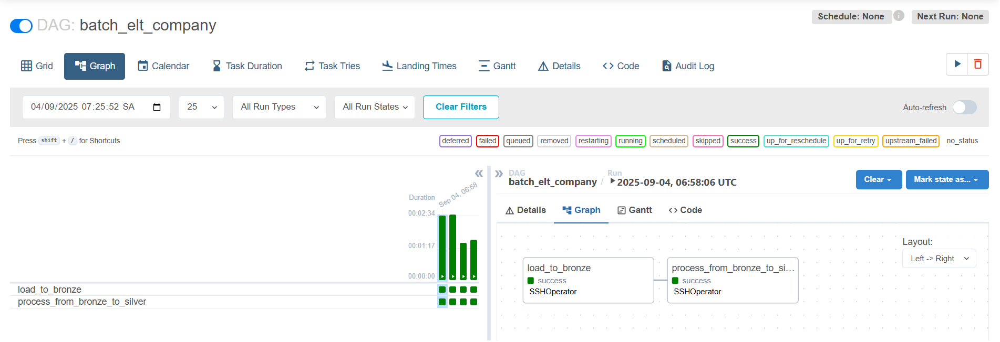
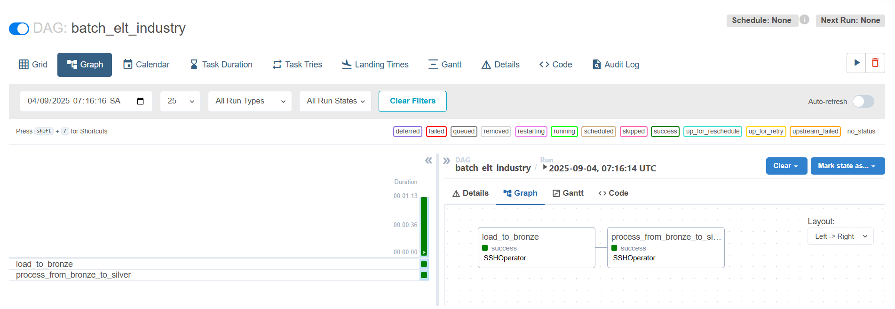
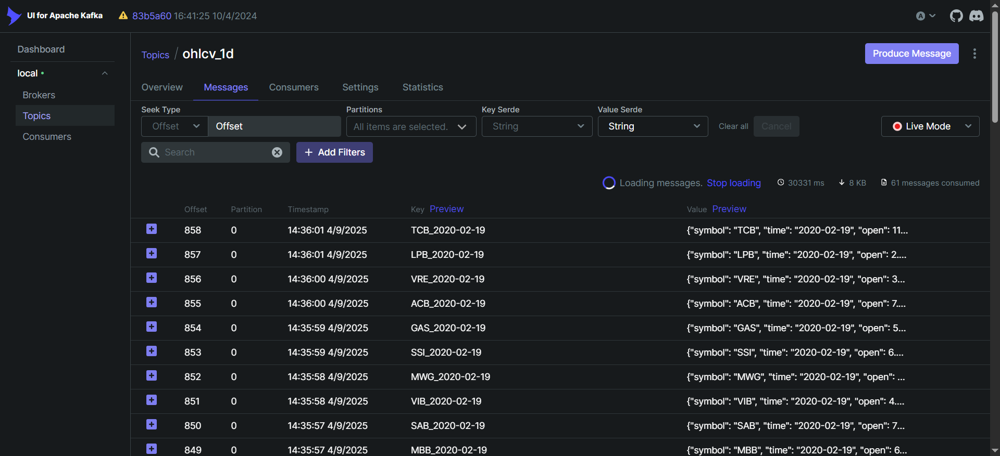

# 📑 Table of Contents

- [📌 1. Introduction](#-1-introduction)
- [🏗 2. Architecture](#-2-architecture)
- [📂 3. Project Structure](#-3-project-structure)
- [🚀 4. Setup](#-4-setup)

---

# 📌 1. Introduction

This project demonstrates a **modern Lakehouse architecture** for streaming data pipelines, built on **Apache Iceberg tables**, providing ACID transactions, schema evolution, and snapshot-based consistency for reliable data storage. Data is progressively refined through a **medallion architecture (Bronze → Silver → Gold)** for analytics and BI use cases. The pipeline supports **real-time ingestion of transactional data** and **scheduled updates of reference/dimension data**.

**Data Source:** Data is fetched through **VNStock Python Library**

**Key features of this project include:**

- **_Unified Data Storage_**: Combine the benefits of data lakes and data warehouses using a Lakehouse approach.
- **_Batch & Stream ELT Pipeline_**: Capture and process streaming data using Kafka & Spark Streaming, and run batch workflows with Apache Airflow for static or reference datasets.
- **_Query & Analytics_**: Enable SQL querying on the Lakehouse using Trino and visualize insights with Superset.
- **_Containerized Architecture_**: All services (Lakehouse stack, Kafka, Spark, Airflow, Superset) are orchestrated via Docker for easy setup and reproducibility.

---

# 🏗 2. Architecture

## 2.1 Lakehouse


💡 **Test creating a table using Trino through DBeaver:**

> The script is put under `experiments` folder
> 

💡 **Check the result on MinIO:**


## 2.2 Pipeline


---

# 📂 3. Project Structure

```text
batch-and-stream-pipeline-via-lakehouse/
│
├── docker/
│   ├── init/                            # Initialization scripts in containers
│   ├── hive/                            # Hive metastore configuration + Dockerfile
│   ├── trino/                           # Trino configuration
│   ├── spark/                           # Spark configuration + Dockerfile
│   ├── airflow/                         # Airflow Dockerfile
│   ├── superset/                        # Superset configuration + Dockerfile
│
├── data/                              # Raw datasets
├── experiments/                       # Notebooks and scripts for testing pipelines and data exploration
├── src/                               # Source code
│   ├── dags/                            # Airflow DAGs scripts to run batch pipeline
│   ├── producer/                        # Kafka data producer scripts
│   ├── bronze/                          # Bronze layer – raw ingested data
│   ├── silver/                          # Silver layer – cleaned, standardized, and enriched data
│   ├── gold/                            # Gold layer – aggregated, analytics-ready data for BI/ML
│
├── readme/                            # Documentation, diagrams, notes
│
├── docker-compose-lakehouse.yml       # Docker Compose for the Lakehouse stack (MinIO, Hive Metastore, Postgres, Trino)
└── docker-compose-kafka.yml           # Docker Compose for Kafka cluster, Schema Registry and Kafka UI
├── docker-compose-spark.yml           # Docker Compose for Spark cluster
├── docker-compose.yml                 # Docker Compose for Airflow, Superset, ...
```

---

# 🚀 4. Setup

## 4.1 Prerequisites

Before starting, please ensure you have:

- Docker Desktop installed and running.
- VS Code installed to open project.
- DBeaver installed to connect to Trino to query data from Lakehouse.

## 4.2 Setup & Initialization

**Step 1:** Before running the pipeline, make sure `make` is installed. On Windows, you install Chocolatey first and then install Make:

```powershell
# Install Chocolatey (run in PowerShell as Administrator)
Set-ExecutionPolicy Bypass -Scope Process -Force; [System.Net.ServicePointManager]::SecurityProtocol = [System.Net.ServicePointManager]::SecurityProtocol -bor 3072; iex ((New-Object System.Net.WebClient).DownloadString('https://community.chocolatey.org/install.ps1'))
# Upgrade Chocolatey (optional but recommended)
choco upgrade chocolatey
# Install Make
choco install make
# Verify installation
make --version
```

**Step 2:** Install Hadoop & Hive to set up Hive Metastore Image:

```bash
# Navigate to hive/jars folder
cd hive/jars
# Run Makefile to install (run in Git Bash)
make download
```

**Step 3:** Set up the whole architecture through Docker:

```bash
# Create a Docker network "common-net" for all services to communicate with each other
docker network create common-net
# Start all services (download if needed) using Makefile
make all-up
```

**Step 4:** Fetch data using the Python script:

```bash
# Run the Python script to download data into the data folder
python data/_get_all_data.py
```

## 4.3 Service Access

### Web UI

- **MinIO UI:** http://localhost:9001
  - User: minio
  - Password: minio123
- **Superset UI:** http://localhost:8088
  - User: superset
  - Password: superset
- **Trino UI:** http://localhost:8080
  - User: trino
  - Password:
- **Kafka UI:** http://localhost:8081
- **Spark Master UI:** http://localhost:8082
- **Spark Worker 1 UI:** http://localhost:8083
- **Airflow UI:** http://localhost:8085
  - User: airflow
  - Password: airflow

### Database / SQL Client

- **Postgres:** localhost:5432 (connect via DBeaver)
  - User: hive
  - Password: hive
  - Database: metastore
- **Trino:** localhost:8080 (connect via DBeaver)
  - User: trino
  - Password:

## 4.4 Run the pipeline

### Step 1: Initializing Schema in Lakehouse

Once Trino container is running, you can initialize the Lakehouse schema using the SQL initialization script:

```bash
# Access the Trino container
make trino-bash
# Run the SQL initialization script
trino --server localhost:8080 --catalog iceberg --file /init/lakehouse_init.sql
```

Here is the result of running the schema initialization script in MinIO:


### Step 2: Running Batch Pipeline

**2.1** Before running the batch pipeline in Airflow, you need to **set up SSH connections** between the Airflow container and the Spark container:

```bash
# Access the Airflow container
make airflow-bash
# Copy Airflow’s SSH public key to Spark container
sshpass -p 'spark_pass' ssh-copy-id -o StrictHostKeyChecking=no -i /home/airflow/.ssh/id_ecdsa.pub spark_user@spark-master
# To verify the result, access Spark container and print the public key
make spark-bash
cat /home/spark_user/.ssh/authorized_keys
```

**2.2** After setting up the SSH connection, access the Airflow UI to trigger the batch DAGs:



💡 Once the DAGs finish, you can open DBeaver and connect to Trino to query the Lakehouse and verify the results.

### Step 3: Running Stream Pipeline

**3.1** Run the script to produce streaming data to Kafka:

```bash
# Access the Airflow container
make airflow-bash
# Run the producer script
python dags/producer/ohlcv_producer.py
```

Check Kafka UI to verify the data stream:


**3.2** Ingest raw streaming data from Kafka into the Lakehouse:

```bash
# Access the Spark container
make spark-bash
# Run the ingestion script
spark-submit bronze/ohlcv_1m.py
```

**3.3** Process data from Bronze to Silver in Lakehouse:

```bash
# Access the Spark container
make spark-bash
# Run the processing script
spark-submit silver/ohlcv_agg.py
```

💡 Check the ingested and processed data in MinIO or query via Trino using DBeaver.

### Step 4:

**⚠️ Ongoing**
# batch-pipeline-via-lakehouse
# batch-pipeline-via-lakehouse
